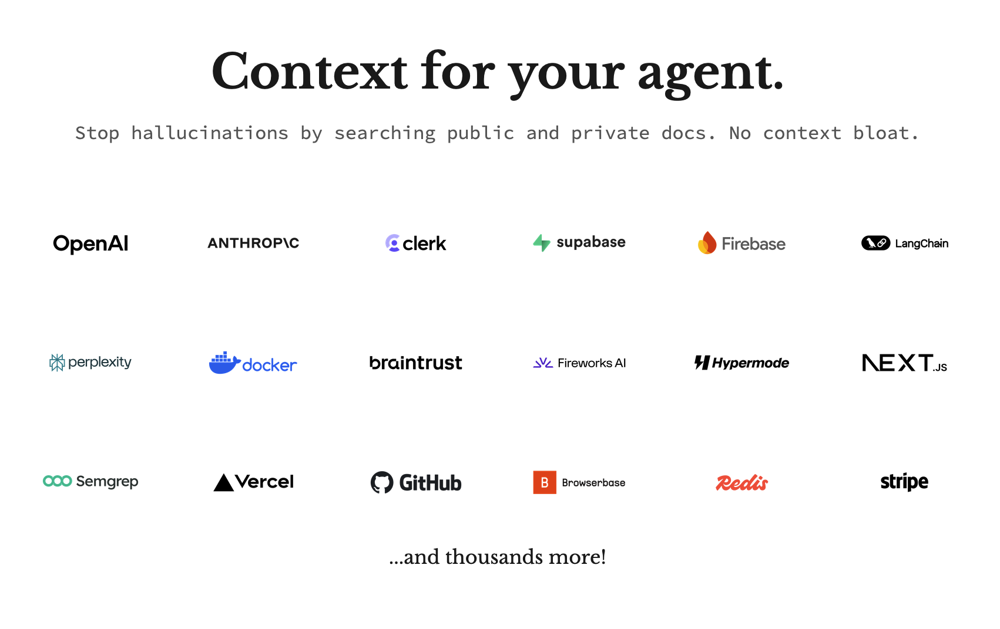

[](https://ref.tools)
[](https://smithery.ai/server/@ref-tools/ref-tools-mcp)

# Ref MCP

A [ModelContextProtocol](https://modelcontextprotocol.io) server that gives your AI coding tool or agent access to documentation for APIs, services, libraries etc. It's your one-stop-shop to keep your agent up-to-date on documentation in a fast and token-efficient way.

For more see info [ref.tools](https://ref.tools)

## Agentic search for exactly the right context

Ref's tools are design to match how models search while using as little context as possible to reduce [context rot](https://research.trychroma.com/context-rot). The goal is to find exactly the context your coding agent needs to be successful while using minimum tokens.

Depending on the complexity of the prompt, LLM coding agents like Claude Code will typically do one or more searches and then choose a few resources to read in more depth.

For a simple query about Figma's Comment REST API it will make a couple calls to get exactly what it needs:
```
SEARCH 'Figma API post comment endpoint documentation' (54 tokens)
READ https://www.figma.com/developers/api#post-comments-endpoint (385 tokens)
```

For more complex situations, the LLM will try to refine it's prompt as it reads results. For example:
```
SEARCH 'n8n merge node vs Code node multiple inputs best practices' (126)
READ https://docs.n8n.io/integrations/builtin/core-nodes/n8n-nodes-base.merge/#merge (4961)
READ https://docs.n8n.io/flow-logic/merging/#merge-data-from-multiple-node-executions (138)
SEARCH 'n8n Code node multiple inputs best practices when to use' (107)
READ https://docs.n8n.io/code/code-node/#usage (80)
SEARCH 'n8n Code node access multiple inputs from different nodes' (370)
SEARCH 'n8n Code node $input access multiple node inputs' (372)
READ https://docs.n8n.io/code/builtin/output-other-nodes/#output-of-other-nodes (2310)
  ```

Ref takes advantage of MCP sessions to track search trajectory and minimize context usage. There's a lot more ideas cooking but here's what we've implemented so far.

### 1. Filtering search results
For repeated similar searches in a session, Ref will never return repeated results. Traditionally, you dig farther in to search results by paging to the next result but this approach allows the agent to page AND adjust the prompt at the same time.

### 2. Fetching the part of the page that matters
When reading a page of documentation, Ref will use the agent's session search history to dropout less relevant sections and return the most relevant 5k tokens. This helps Ref avoid a big problem with standard `fetch()` web scraping which is when it hits a large documentation page you can easily end up pull in 20k+ tokens into context, most of which are irrelevant. 

## Why does minimizing tokens from documentation context matter?

### 1. More context makes models dumber

It's well documented that as of July 2025 that models get dumber as you put in more tokens. You might have heard about how models are great with long context now and that's kind of true but not the whole picture. For a quick primer on some research, [checkout this video from the team at Chroma](https://www.youtube.com/watch?v=TUjQuC4ugak).

### 2. Tokens cost $$$

Imagine you are using Claude Opus as a background agent and you start by having the agent pull in documentation context and suppose it pulls in 10000 tokens of context with 4000 being relevant and 6000 being extra noise. At API pricing, that 6k tokens cost about $0.09 PER STEP. If one prompt ends up taking 11 steps with Opus, you've spent $1 for no reason. 


## Setup

There are two options for setting up Ref as an MCP server, either via the streamable-http server (recommended) or local stdio server (legacy). 

This repo contains the legacy stdio server. 

### Streamable HTTP (recommended)

[](https://cursor.com/install-mcp?name=Ref&config=eyJjb21tYW5kIjoibnB4IiwiYXJncyI6WyIteSIsIm1jcC1yZW1vdGVAMC4xLjAtMCIsImh0dHBzOi8vYXBpLnJlZi50b29scy9tY3AiLCItLWhlYWRlcj14LXJlZi1hcGkta2V5OjxzaWduIHVwIHRvIGdldCBhbiBhcGkga2V5PiJdfQ==)

```
"Ref": {
  "type": "http",
  "url": "https://api.ref.tools/mcp?apiKey=YOUR_API_KEY"
}
```

### stdio 

[](https://cursor.com/install-mcp?name=Ref&config=eyJjb21tYW5kIjoibnB4IiwiYXJncyI6WyJyZWYtdG9vbHMtbWNwIl0sImVudiI6eyJSRUZfQVBJX0tFWSI6IjxzaWduIHVwIHRvIGdldCBhbiBhcGkga2V5PiJ9fQ==)

```
"Ref": {
  "command": "npx",
  "args": ["ref-tools-mcp@latest"],
  "env": {
    "REF_API_KEY": <sign up to get an api key>
  }
}
```

## Tools

Ref MCP server provides all the documentation related tools for your agent needs.

### ref_search_documentation

A powerful search tool to check technical documentation. Great for finding facts or code snippets. Can be used to search for public documentation on the web or github as well from private resources like repos and pdfs.

**Parameters:**
- `query` (required): Query to search for relevant documentation. This should be a full sentence or question.

### ref_read_url

A tool that fetches content from a URL and converts it to markdown for easy reading with Ref. This is powerful when used in conjunction with the ref_search_documentation tool that returns urls of relevant content.

**Parameters:**
- `url` (required): The URL of the webpage to read.


## OpenAI deep research support

Ref can be used as a source for deep research. OpenAI requires specific tool definitions so when used with an OpenAI client, Ref will provide the same tools with slightly different naming.

```
ref_search_documentation(query) -> search(query)
ref_read_url(url) -> fetch(id)
```

## Development

## Benchmarks (GraphDB vs SearchDB)

A simple benchmark harness is included to ingest several popular open-source repos, index them into `GraphDB` and `SearchDB`, run a handful of representative queries, and record latencies.

- Setup sample repos (cloned as a sibling directory `../bench_repos`):

  - `npm run bench:setup`

- Run benchmarks (set `BENCH_ITERS` to adjust per-query iterations; default 5):

  - `BENCH_ITERS=5 npm run bench:run`

  Results are written to `bench/results/` as JSON, and a summary index is maintained at `bench/results/index.json`.

- Visualize results:

  - `npm run bench:viz`

  Opens a minimal static viewer at `bench/viewer/index.html` that auto-refreshes and shows per-repo summaries plus per-query charts with error bars (mean ± stdev). It reacts to new runs automatically.

Repos used by default: chalk, axios, date-fns, express, and a large, real-world app for stress testing (microsoft/vscode). You can pre-clone your own into `../bench_repos/<name>` and extend the list in `cli_bench.ts`.

Per-repo SearchDB queries are realistic and domain-specific (10 each).
GraphDB queries cover structural counts (files/chunks by language/type, size thresholds, and edges) to exercise pattern and filter performance.

```
npm install
npm run dev
```

### Running with Inspector

For development and debugging purposes, you can use the MCP Inspector tool. The Inspector provides a visual interface for testing and monitoring MCP server interactions.

Visit the [Inspector documentation](https://modelcontextprotocol.io/docs/tools/inspector) for detailed setup instructions.

To test locally with Inspector:
```
npm run inspect
```

Or run both the watcher and inspector:
```
npm run dev
```

### Local Development

1. Clone the repository
2. Install dependencies:
```bash
npm install
```
3. Build the project:
```bash
npm run build
```
4. For development with auto-rebuilding:
```bash
npm run watch
```

Rust native SearchDB bindings
- See `RUST_BINDINGS.md` for building the Rust-backed search engine and enabling it in the agent or benchmarks.

## License

MIT
